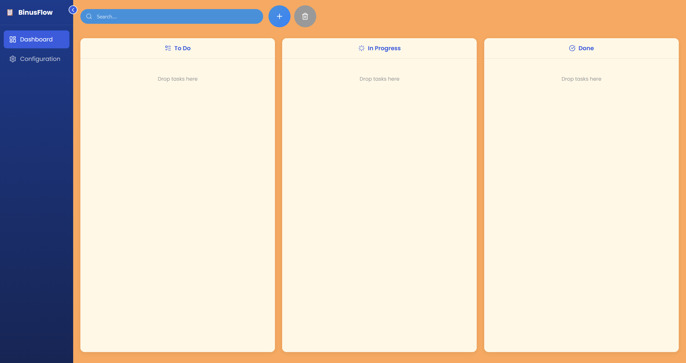
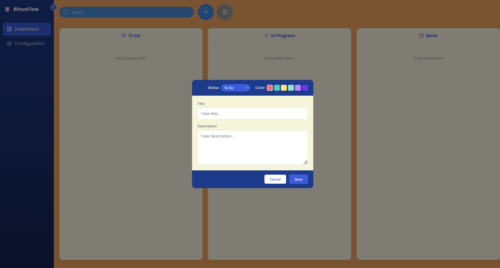
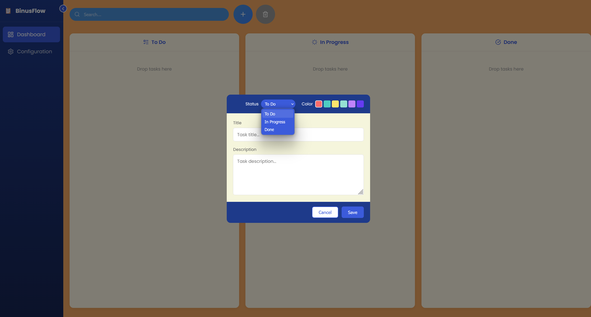
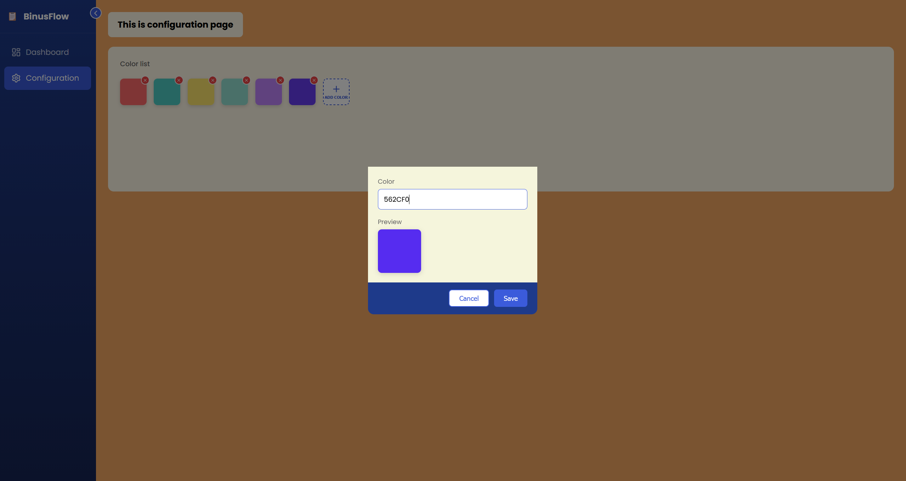

# 🚀 BinusFlow – Task Board Management System

BinusFlow adalah **web-based task board application** yang dirancang untuk membantu pengguna mengelola tugas secara terstruktur menggunakan konsep **Kanban-style workflow**.

Project ini dikembangkan sebagai bagian dari **IT Division Technical Task (NET C# Track)** dan berfokus pada clean UI, modern frontend stack, serta struktur kode yang rapi dan scalable.

---

## ✨ Features

- 📋 **Task Board (Kanban Style)**
  - To Do, In Progress, Done
- 🧩 **Task Management**
  - Create, update, delete task
- 🎨 **Modern UI**
  - Clean & responsive interface
- ⚡ **Fast Development**
  - Powered by Vite

---
## 🖼️ Screenshot Aplikasi

### Dashboard (Kanban Board)


### Add / Edit Task Modal


### Configuration Page


### Add Custom Color


## 🛠️ Tech Stack

### Frontend
- React
- TypeScript
- Vite

### Tooling
- npm
- ESLint
- Git & GitHub

---

## 📂 Project Structure

```text
BinusFlow-TaskBoard/
│
├── binusflow/           # Main frontend application
│   ├── src/             # Source code
│   ├── public/          # Static assets
│   ├── index.html
│   ├── package.json
│   └── vite.config.ts
│
├── .gitignore
└── README.md

```
## 🚀 How to Run Locally

Make sure Node.js is installed.

```bash
# Move to project folder
cd binusflow

# Install dependencies
npm install

# Run development server
npm run dev
```
How to Run Locally
Then open your browser at: http://localhost:5173


